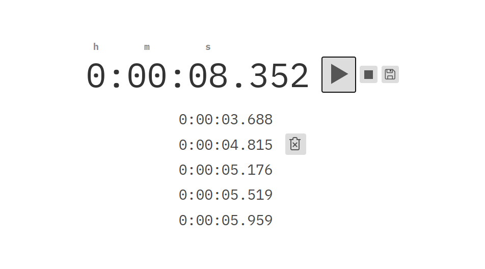

# Preact Timer App

A simple app made to test Preact without a build step. Everything is saved to `localStorage`.



This is also aviable at <https://timer.aziis98.vercel.app/> (yep also testing Vercel)

## Description

This uses <https://github.com/developit/htm> with <https://preactjs.com/> by the import

```js
import { html, Component, render } from 'https://unpkg.com/htm/preact/standalone.module.js'
```

All code is in [dist/main.js](dist/main.js) and the styles are in [dist/style.css](dist/style.css).

## Usage

```bash
# Installs live-server (only dependency)
npm install

# Starts a hot reload server in the dist folder
npm run serve
```